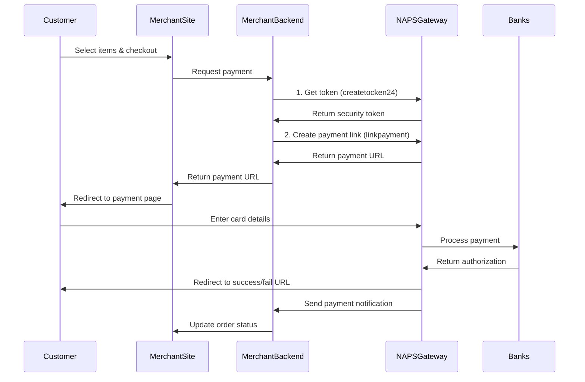
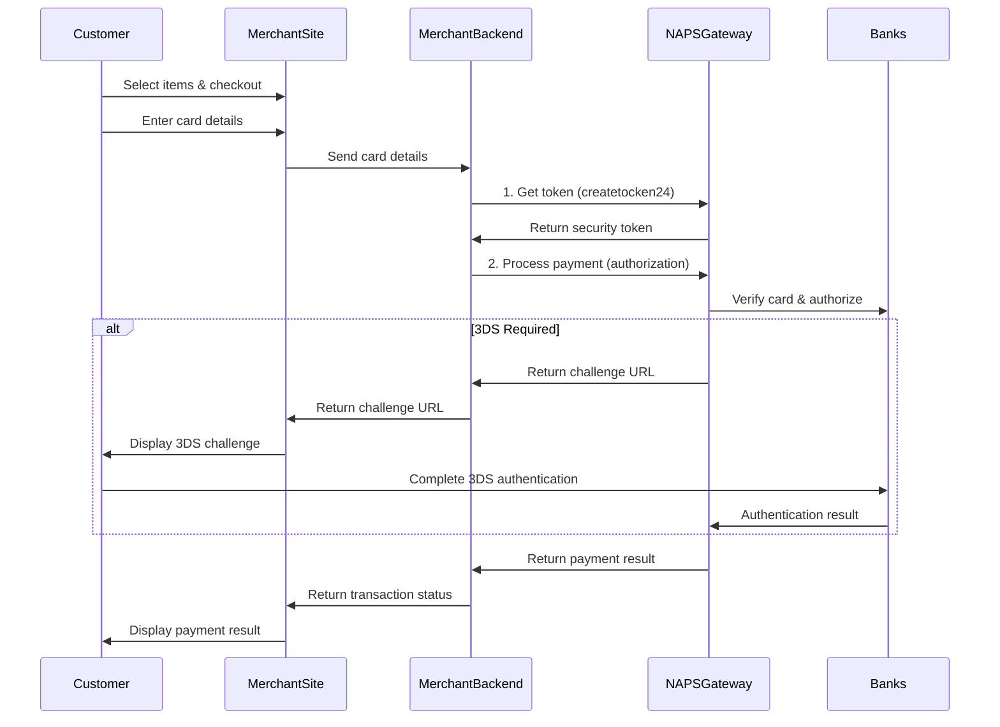

# NAPS Payment Gateway Integration Technical Guide

This document provides comprehensive implementation guidance for the NAPS Payment Gateway using MXPlus API. There are two main integration approaches:

1. NAPS-Managed Payment Page (Redirect Flow)
2. Merchant-Managed Payment Page (Direct Integration)

## 1. NAPS-Managed Payment Page (Redirect Flow)

In this approach, the customer is redirected to a NAPS-hosted payment page for secure card data collection.

### 1.1. Integration Flow



### 1.2. API Endpoints

#### 1.2.1. Get Security Token (Required for all requests)

**Endpoint:** `https://gwapi.naps.ma:8085/napspayment/createtocken24`  
**Method:** POST  
**Content-Type:** application/json

**Request Body:**
```json
{
  "institution_id": "11010",
  "cx_user": "NAPS",
  "cx_password": "2e6a98abb5b23339ad14601d3bedc1d23847498cb18daf8cfc98c2a2095ec8",
  "cx_reason": "00",
  "mac_value": "MD5(institution_id+cx_user)"
}
```

**Response Body (Success):**
```json
{
  "institution_id": "11010",
  "cx_user": "NAPS",
  "cx_securtoken_24": "TOKEN_VALUE_HERE",
  "error_msg": "",
  "error_code": "000",
  "mac_value": "MD5_VALUE"
}
```

#### 1.2.2. Create Payment Link

**Endpoint:** `https://gwapi.naps.ma:8085/napspayment/linkpayment`  
**Method:** POST  
**Content-Type:** application/json

**Request Body:**
```json
{
  "capture": "Y",
  "transactiontype": "0",
  "currency": "504",
  "orderid": "YOUR_UNIQUE_ORDER_ID",
  "recurring": "N",
  "amount": "1000",
  "securtoken24": "TOKEN_FROM_PREVIOUS_STEP",
  "mac_value": "MD5(orderid+amount)",
  
  "merchantid": "YOUR_MERCHANT_ID",
  "merchantname": "YOUR_MERCHANT_NAME",
  "websitename": "YOUR_WEBSITE_NAME",
  "websiteid": "YOUR_WEBSITE_ID",
  "callbackurl": "https://your-domain.com/api/payments/callback",
  "successURL": "https://your-domain.com/payment/success",
  "failURL": "https://your-domain.com/payment/fail",
  
  "fname": "Customer First Name",
  "lname": "Customer Last Name",
  "email": "customer@example.com",
  "phone": "0612345678",
  "address": "Customer Address",
  "city": "City",
  "zipcode": "12345",
  "country": "504",
  "id_client": "",
  "token": ""
}
```

**Response Body (Success):**
```json
{
  "statuscode": "00",
  "status": "Success",
  "orderid": "YOUR_UNIQUE_ORDER_ID",
  "amount": "1000",
  "transactiondate": "2025-03-01",
  "transactiontime": "18:30:45",
  "transactionid": "123456789",
  "url": "https://gwapi.naps.ma:8085/payment?ref=PAYMENT_REFERENCE"
}
```

#### 1.2.3. Payment Notification (Callback)

When payment is completed, NAPS will send a POST request to your `callbackurl` with:

**Request Body (to your callback URL):**
```json
{
  "repauto": "00",
  "montant": "1000",
  "signature": "MD5(idcommande+repauto+keypub+montant)",
  "numAuto": "123456",
  "numTrans": "336552",
  "idcommande": "YOUR_UNIQUE_ORDER_ID",
  "carte": "531245******4508",
  "typecarte": "2",
  "token": "CARD_TOKEN_IF_SAVED"
}
```

**Expected Response (from your callback endpoint):**
```json
{
  "msg": "GATESUCCESS"
}
```

#### 1.2.4. Final Redirect

After processing, NAPS redirects the customer to your success or failure URL with encrypted data:

**Success URL:**
```
https://your-domain.com/payment/success?data=ENCRYPTED_DATA
```

The encrypted data contains:
- id_commande (order ID)
- nomprenom (customer name)
- email (customer email)
- montant (amount)
- repauto (response code)
- numAuto (authorization number)
- numCarte (masked card number)
- typecarte (card type)
- numTrans (transaction ID)

### 1.3. Implementation Notes

- Always generate unique order IDs to avoid "PaiementRequest Already exist" errors
- Implement the callback endpoint to return "GATESUCCESS" or "GATEFAILED" based on your business logic
- RSA decryption is required to decode the final response data
- Securely store the security token for subsequent API calls within the same session

## 2. Merchant-Managed Payment Page (Direct Integration)

In this approach, you collect card details on your own site and send them to NAPS for processing.

### 2.1. Integration Flow



### 2.2. API Endpoints

#### 2.2.1. Get Security Token

Same as in approach 1.2.1.

#### 2.2.2. Process Payment Directly

**Endpoint:** `https://gwapi.naps.ma:8085/napspayment/authorization`  
**Method:** POST  
**Content-Type:** application/json

**Request Body:**
```json
{
  "capture": "Y",
  "transactiontype": "0",
  "currency": "504",
  "orderid": "YOUR_UNIQUE_ORDER_ID",
  "recurring": "N",
  "auth3ds": "Y",
  "amount": "1000",
  "securtoken24": "TOKEN_FROM_PREVIOUS_STEP",
  "mac_value": "MD5(orderid+amount)",
  
  "merchantid": "YOUR_MERCHANT_ID",
  "merchantname": "YOUR_MERCHANT_NAME",
  "websitename": "YOUR_WEBSITE_NAME",
  "websiteid": "YOUR_WEBSITE_ID",
  "callbackurl": "https://your-domain.com/api/payments/callback",
  "successURL": "https://your-domain.com/payment/success",
  "failURL": "https://your-domain.com/payment/fail",
  
  "cardnumber": "4111111111111111",
  "expirydate": "2512",
  "holdername": "JOHN DOE",
  "cvv": "123",
  
  "fname": "Customer First Name",
  "lname": "Customer Last Name",
  "email": "customer@example.com",
  "country": "504",
  "phone": "0612345678",
  "city": "City",
  "state": "State",
  "zipcode": "12345",
  "address": "Customer Address"
}
```

**Response Body (Success with No 3DS):**
```json
{
  "statuscode": "00",
  "status": "Success",
  "orderid": "YOUR_UNIQUE_ORDER_ID",
  "amount": "1000",
  "transactiondate": "2025-03-01",
  "transactiontime": "18:30:45",
  "authnumber": "123456",
  "paymentid": "ABC123DEF456",
  "transactionid": "123456789",
  "etataut": "Y",
  "merchantid": "YOUR_MERCHANT_ID",
  "merchantname": "YOUR_MERCHANT_NAME",
  "websitename": "YOUR_WEBSITE_NAME",
  "websiteid": "YOUR_WEBSITE_ID",
  "cardnumber": "411111******1111",
  "fname": "Customer First Name",
  "lname": "Customer Last Name",
  "email": "customer@example.com"
}
```

**Response Body (3DS Challenge Required):**
```json
{
  "statuscode": "00",
  "status": "Success",
  "orderid": "YOUR_UNIQUE_ORDER_ID",
  "amount": "1000",
  "transactiondate": "2025-03-01",
  "transactiontime": "18:30:45",
  "authnumber": "123456",
  "paymentid": "ABC123DEF456",
  "transactionid": "123456789",
  "etataut": "C",
  "treedsid": "3ds-transaction-id",
  "linkacs": "https://3ds-authentication-url",
  "merchantid": "YOUR_MERCHANT_ID",
  "cardnumber": "411111******1111",
  "fname": "Customer First Name",
  "lname": "Customer Last Name",
  "email": "customer@example.com"
}
```

### 2.3. Handling 3DS Authentication

If the response contains `etataut` = "C", you must redirect the user to the URL in `linkacs` to complete 3DS authentication. After authentication, the user will be redirected to your successURL or failURL based on the outcome.

### 2.4. Implementation Notes

- PCI DSS compliance is required for this approach since you handle card data
- Always use HTTPS and secure coding practices
- Consider using a secure iframe or JavaScript library for collecting card details
- Remove card details from memory as soon as possible after submission
- Store the card token (if provided) instead of card details for future transactions

## 3. Additional Operations

### 3.1. Check Payment Status

**Endpoint:** `https://gwapi.naps.ma:8085/napspayment/status`  
**Method:** POST  
**Content-Type:** application/json

**Request Body:**
```json
{
  "orderid": "YOUR_UNIQUE_ORDER_ID",
  "authnumber": "AUTHORIZATION_NUMBER",
  "amount": "1000",
  "securtoken24": "TOKEN_FROM_PREVIOUS_STEP",
  "mac_value": "MD5(orderid+amount)",
  "merchantid": "YOUR_MERCHANT_ID"
}
```

**Response Body:**
```json
{
  "status": "Paid",
  "statuscode": "00",
  "authstatuscode": "00",
  "authstatus": "Approved",
  "transactiondate": "2025-03-01",
  "transactiontime": "18:30:45",
  "authdate": "2025-03-01",
  "authtime": "18:30:45",
  "authnumber": "123456",
  "transactionid": "123456789",
  "merchantid": "YOUR_MERCHANT_ID"
}
```

### 3.2. Void/Cancel Transaction

**Endpoint:** `https://gwapi.naps.ma:8085/napspayment/reversal`  
**Method:** POST  
**Content-Type:** application/json

**Request Body:**
```json
{
  "orderid": "YOUR_UNIQUE_ORDER_ID",
  "authnumber": "AUTHORIZATION_NUMBER",
  "paymentid": "PAYMENT_ID",
  "amount": "1000",
  "securtoken24": "TOKEN_FROM_PREVIOUS_STEP",
  "mac_value": "MD5(orderid+amount)",
  "merchantid": "YOUR_MERCHANT_ID",
  "merchantname": "YOUR_MERCHANT_NAME"
}
```

### 3.3. Capture Delayed Authorization

**Endpoint:** `https://gwapi.naps.ma:8085/napspayment/capture`  
**Method:** POST  
**Content-Type:** application/json

**Request Body:**
```json
{
  "orderid": "YOUR_UNIQUE_ORDER_ID",
  "paymentid": "PAYMENT_ID",
  "amount": "1000",
  "authnumber": "AUTHORIZATION_NUMBER",
  "securtoken24": "TOKEN_FROM_PREVIOUS_STEP",
  "mac_value": "MD5(orderid+amount)",
  "merchantid": "YOUR_MERCHANT_ID",
  "merchantname": "YOUR_MERCHANT_NAME"
}
```

## 4. Security Considerations

- Generate unique order IDs including random components to prevent duplicate submissions
- Implement proper error handling and logging
- Use HTTPS for all communications
- Store sensitive information securely
- Implement proper validation of all responses
- Handle timeouts and network errors gracefully
- When testing, use test cards provided by NAPS
- Monitor transaction metrics and implement alerts for suspicious patterns

## 5. Error Codes

| Code | Description |
|------|-------------|
| 00 | Approved |
| 01 | Refer to Card Issuer |
| 02 | Refer to Card Issuer Special |
| 13 | Invalid Amount |
| 51 | Insufficient Funds |
| 54 | Expired Card |
| 55 | Incorrect PIN |
| 57 | Transaction Not Permitted |
| ... | ... |

Refer to the complete documentation for all error codes and their descriptions.